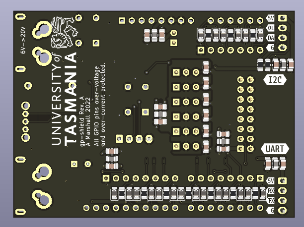

# gp-shield
## A general purpose arduino-compatible shield for UTAS projects

  
   

## Overview
The shield is intended to be used as a general purpose shield for Arduino Uno compatible microcontroller development boards or as an interface between a development board and other custom electronics.

From previous projects we have identified multiple common issues when interfacing with common microcontroller development boards including the Arduino UNO and Xplained Mini series of development boards.
- Many development boards are sensitive to fluctuations in the power supply during programming and can become 'bricked'.
- A lack of protection on the Vin and 5V lines when being powered from a shield or other electronics makes them susceptible to damage.
- Due to the lack of protection and the large number of exposed GPIO pins it is easy to draw too much current or apply an overvoltage condition which will damage the microcontroller.

**See [Rugged Circuits](https://www.rugged-circuits.com/10-ways-to-destroy-an-arduino) for more detail on common issues with the Arduino UNO.**

To resolve these issue for most use cases and provide general functionality commonly needed in electronics projects we have developed the gp-shield to be used as the standard method of interfacing with Arduino UNO compatible development boards.

## Features
- Can be powered from external battery (~6V - 20V)
- On-board power supply with overvoltage (25V?), overcurrent (6A), and reverse polarity protection as well as adjustable undervoltage lockout and an on-board or external power switch.
- Onboard 5V regulation (up to 1A output) with circuitry with a jumper to isolate 5V from the development board.
- Overvoltage (~5.1V) and overcurrent (~30mA) protection on all GPIO pins when using the on-board headers and connectors.
- ICD style analogue outputs, PORTD and PORTB GPIO pins, 6 servo-style PWM outputs, UART, SPI and a high current output for powereing other electronics from the same supply with all of the built in seafty features.
- On-board microcontroller reset button
- On-board general purpose LED and push button

The board itself is 2-layers with double-sided load. All components use footprints suitable for hand-soldering. It is intended to be assembled in-house using pick-and-place machine and reflow soldering.
